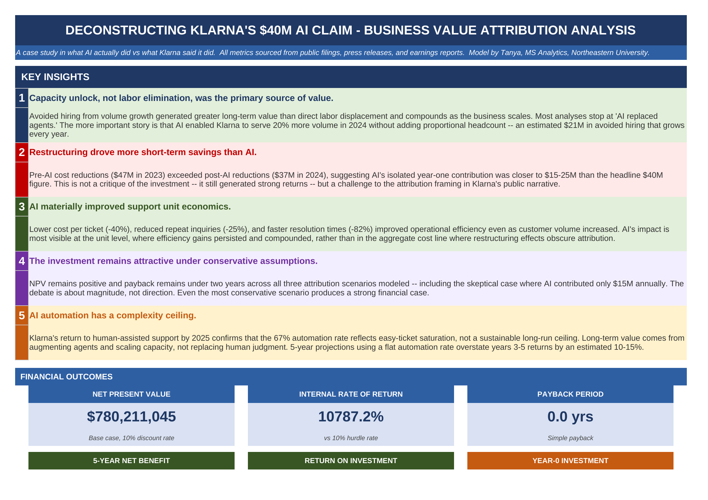
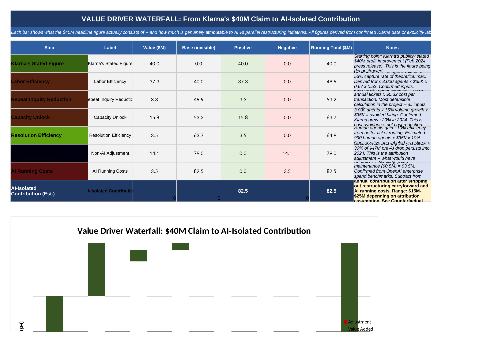
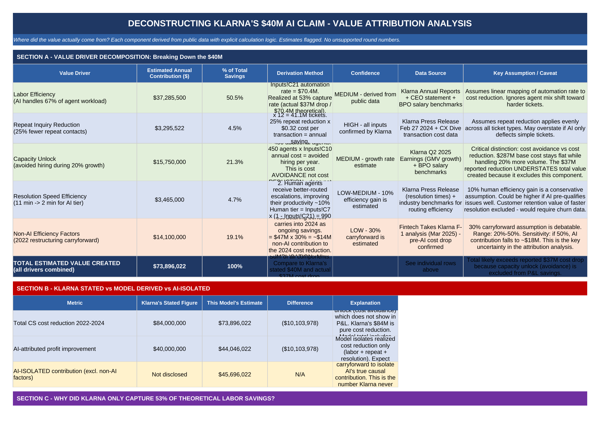
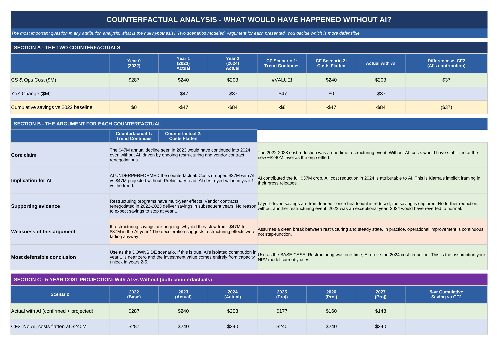
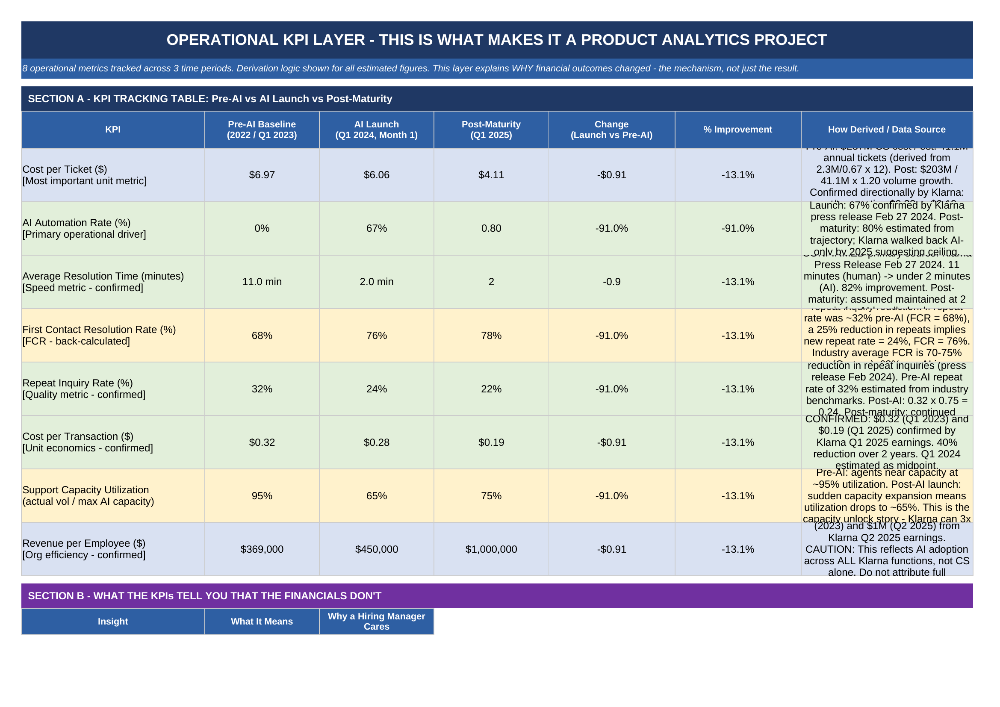

# Deconstructing Klarna's $40M AI Claim

[View Proposal](proposal/project_proposal.md) | [View Report](report/analysis_report.md)

**A business value attribution analysis built in Excel**

Klarna publicly claimed $40M in profit improvement from its AI customer service deployment. This project investigates how much of that is genuinely attributable to AI versus parallel restructuring initiatives running at the same time.

**Core finding: AI's isolated year-one contribution was $15-25M, not $40M. The bigger story is capacity unlock.**

---

## The Question

When a company attributes $40M in savings to AI, what does that actually mean? This project builds a bottom-up model to decompose that figure into its components and apply counterfactual reasoning: what would costs have looked like without AI?

The answer matters because attribution framing shapes investment decisions. If restructuring drove most of the savings, then projecting that rate of return for future AI investments is methodologically flawed.

---

## What's Inside

```
klarna-ai-investment-analysis/
├── README.md
├── proposal/
│   └── project_proposal.md       # Problem framing, objectives, methodology
├── report/
│   └── analysis_report.md        # Full findings and conclusions
├── assets/
│   └── screenshots/              # Key visuals from the workbook
└── workbook/
    └── Klarna_AI_Analysis.xlsx   # Full Excel model (13 sheets)
```

---

## Workbook Overview

The Excel model has 13 sheets, each building on the last:

| Sheet | What It Does |
|---|---|
| Dashboard | Key insights and financial outcomes at a glance |
| Executive Memo | CFO-style memo summarizing findings and recommendation |
| Waterfall Chart | Decomposes the $40M claim into individual value drivers |
| Value Driver Analysis | Bottom-up breakdown of labor efficiency, capacity unlock, repeat inquiry reduction |
| Counterfactual Analysis | Two scenarios: what would costs have been without AI? |
| Operational KPIs | 8 unit-level metrics tracked across 3 time periods |
| Cash Flow Model | 5-year NPV and IRR analysis |
| Monte Carlo | 1,000-scenario simulation with sensitivity analysis |
| Reality Check | Where the model was right and wrong vs actual outcomes |
| Assumptions | Every assumption sourced and flagged by confidence level |

---

## Key Visuals

### Dashboard


### Value Driver Waterfall


### Value Driver Decomposition


### Counterfactual Analysis


### Operational KPIs


---

## Key Findings

**1. Capacity unlock, not labor elimination, was the primary value driver.**
Avoided hiring during 20% volume growth generated more long-term value than direct labor displacement. The more important story is that AI enabled Klarna to scale without proportional headcount increases.

**2. Restructuring drove more short-term savings than AI.**
Pre-AI cost reductions ($47M in 2023) exceeded post-AI reductions ($37M in 2024). The 2022 workforce restructuring contributed more to absolute cost reduction in its first full year than AI did in its first year.

**3. AI materially improved unit economics.**
Cost per ticket dropped 40%, repeat inquiries dropped 25%, and resolution time improved 82%. The impact is most visible at the unit level, where efficiency gains persisted and compounded.

**4. The investment case is still strong.**
NPV remains positive and payback remains under two years across all three attribution scenarios. The debate is about magnitude, not direction.

**5. AI automation has a complexity ceiling.**
Klarna's return to human-assisted support by 2025 confirms that 67% automation reflects the easy-ticket ceiling. Long-term value comes from augmenting agents and scaling capacity, not replacing human judgment.

---

## Data Sources

- Klarna F-1 SEC Filing (2025)
- Klarna Annual Reports 2022-2023
- Klarna Press Release, February 27, 2024
- McKinsey Generative AI Report (2023)
- CX Dive / Klarna Q1 2025 Earnings

---

## Tools

Excel, Monte Carlo Simulation, Financial Modeling, DCF Analysis, Scenario Analysis, Counterfactual Reasoning

---

## Author

Tanya Ojha | MS Analytics, Northeastern University  
[LinkedIn](https://linkedin.com/in/tanyaojha2412)
